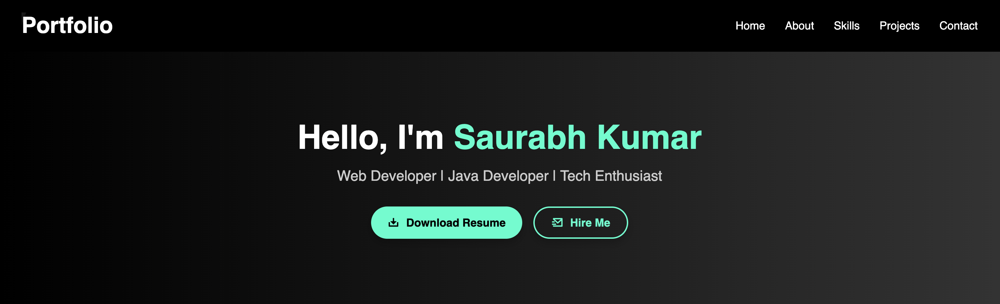
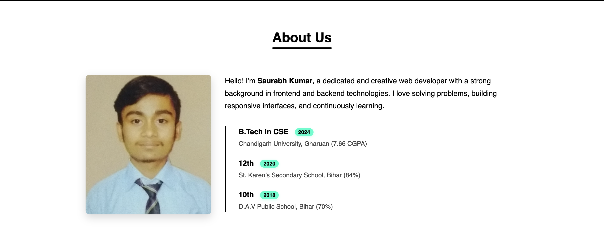
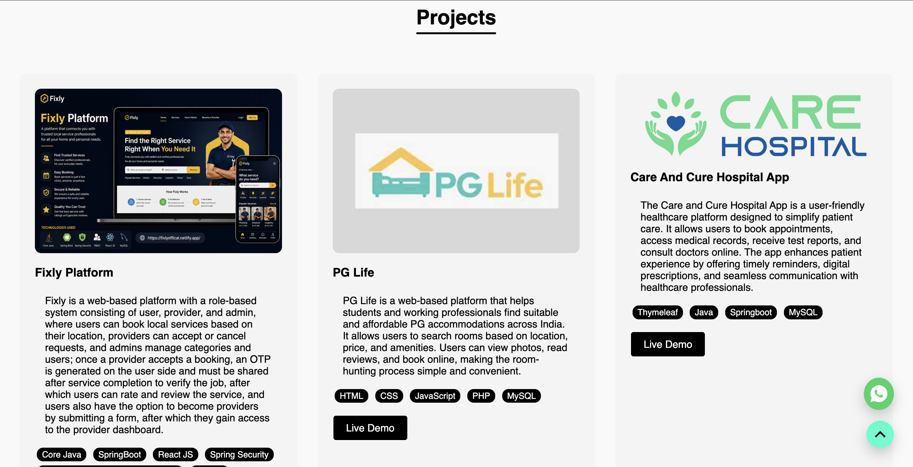
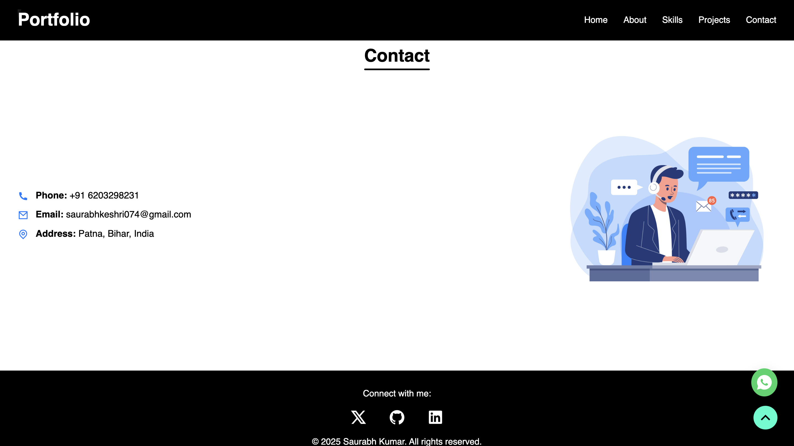

# 🌐 Personal Portfolio - Saurabh Keshri

🔗 **Live Portfolio:** https://fixlyoffical.netlify.app/
📁 **GitHub Repo:** https://github.com/Saurabhh0000/Portfolio

---

## 📌 About Me

Hi, I’m **Saurabh Keshri**, a passionate Full Stack Developer with a strong interest in building scalable web applications and solving real-world problems.

This portfolio showcases my projects, skills, and experience.

---

## 🚀 Features

- 💼 Projects showcase with live demo links
- 📱 Fully responsive design (mobile-friendly)
- 🎨 Modern UI with clean layout
- 📄 Resume download option
- 📬 Contact section

---

## 🧠 Skills & Technologies

I have hands-on experience with the following technologies:

- Core Java
- Collections and Framework
- Spring Boot
- Spring Security
- Spring MVC
- Spring Data JPA
- RBAC (Role Based Access Control)
- React JS
- HTML, CSS, JavaScript
- MySQL

---

## 📂 Projects Included

### 🔧 Fixly Platform

A service booking platform connecting users with local professionals like plumbers and electricians.

👉 Live: https://fixlyoffical.netlify.app/

---

### 🏠 PG Life

A platform to find PG accommodations based on location, price, and amenities.

---

### 📝 Todo App

A simple task management application to organize daily activities.

---

## 📸 Screenshots

## 🏠 Home Page



## 📬 About Us Section



## 📬 Skills Section


## 💼 Projects Section



## 📬 Contact Section



---

## 📦 Installation & Setup

1. Clone the repository:

```bash
git clone https://github.com/Saurabhh0000/Portfolio.git
```

2. Navigate to project folder:

```bash
cd Portfolio
```

3. Open `index.html` in browser

---

## 📬 Contact Me

- 📧 Email: [saurabhkeshri074@gmail.com](mailto:your-email@example.com)
- 💼 LinkedIn: (https://www.linkedin.com/in/saurabh-kumar-fronted-developer/)
- 🐙 GitHub: https://github.com/Saurabhh0000

---

## ⭐ Show Your Support

If you like this project, give it a ⭐ on GitHub!

---
